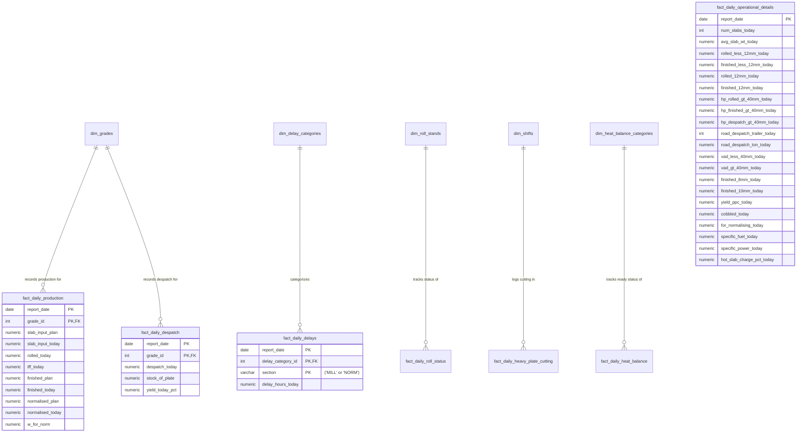

# Database Design: Plate Mill Daily Production Reporting System
**Bhilai Steel Plant**

This document proposes a normalized, relational database schema designed to support the **Daily Production Report** of the Plate Mill at the Bhilai Steel Plant. 

---

## 1. Design Philosophy
The report contains many calculated metrics (such as cumulative values `CUMM`, monthly rates `M/RATE`, achievement percentages `% FILL`, and yields). Storing these computed fields directly in a transactional database leads to data redundancy and the potential for inconsistency. 

Our proposed design:
* **Stores only raw daily transactional inputs.**
* **Uses standard master tables** for grades, delay categories, stands, and shifts to ensure data integrity.
* **Calculates cumulative, monthly, and yearly totals dynamically** using SQL window functions and aggregation, which can be exposed via database Views.
* **Maintains historical tracking** by indexing all facts against a `report_date`.

---

## 2. Entity Relationship Diagram (Conceptual)

Below is the relationship structure between the master dimensions and the daily log (fact) tables:



---

## 3. Database Schema Definition (SQL DDL)

Here is the DDL to create the proposed database structure. It is compatible with PostgreSQL, SQL Server, and MySQL.

### 3.1. Master / Reference Tables

```sql
-- 1. Grade Master (e.g., B.Q, H.T, API, GR-C, CU-BR, EX-HT, BO/SBQ, EXPORT, OTHERS, O.S.S, S/STEEL)
CREATE TABLE dim_grades (
    grade_id INT PRIMARY KEY AUTO_INCREMENT,
    grade_name VARCHAR(50) NOT NULL UNIQUE,
    display_order INT DEFAULT 0,
    is_active BOOLEAN DEFAULT TRUE
);

-- 2. Delay Category Master (e.g., PLANNED, ELECTRICAL, MECHANICAL, OPERATION, S.B.S, FUEL/EMD, POWER, MSDS, OTHERS)
CREATE TABLE dim_delay_categories (
    delay_category_id INT PRIMARY KEY AUTO_INCREMENT,
    category_name VARCHAR(50) NOT NULL UNIQUE,
    display_order INT DEFAULT 0
);

-- 3. Roll Stand Master (e.g., R/STD. TOP, R/STD. BOTTOM, F/STD. TOP, F/STD. BOTTOM, R/STD. W/ROLL, F/STD. W/ROLL)
CREATE TABLE dim_roll_stands (
    roll_stand_id INT PRIMARY KEY AUTO_INCREMENT,
    stand_name VARCHAR(50) NOT NULL UNIQUE,
    display_order INT DEFAULT 0
);

-- 4. Shift Master (A, B, C)
CREATE TABLE dim_shifts (
    shift_id INT PRIMARY KEY AUTO_INCREMENT,
    shift_name CHAR(1) NOT NULL UNIQUE
);

-- 5. Heat Balance Categories (BQ, HT, MILD, RAIL, ROAD, ZCMO, BFR, BFD)
CREATE TABLE dim_heat_balance_categories (
    heat_balance_category_id INT PRIMARY KEY AUTO_INCREMENT,
    category_name VARCHAR(50) NOT NULL UNIQUE,
    display_order INT DEFAULT 0
);
```

### 3.2. Transactional / Daily Fact Tables

```sql
-- 6. Main Production Log (Slab Input, Rolled, TFF, Finished, Normalised, Waiting for Normalising)
CREATE TABLE fact_daily_production (
    report_date DATE NOT NULL,
    grade_id INT NOT NULL,
    slab_input_plan NUMERIC(12, 3) DEFAULT 0.000, -- Monthly/Period Plan target for Slab Input
    slab_input_today NUMERIC(12, 3) DEFAULT 0.000,
    rolled_today NUMERIC(12, 3) DEFAULT 0.000,
    tff_today NUMERIC(12, 3) DEFAULT 0.000,
    finished_plan NUMERIC(12, 3) DEFAULT 0.000, -- Monthly/Period Plan target for Finished
    finished_today NUMERIC(12, 3) DEFAULT 0.000,
    normalised_plan NUMERIC(12, 3) DEFAULT 0.000, -- Monthly/Period Plan target for Normalised
    normalised_today NUMERIC(12, 3) DEFAULT 0.000,
    w_for_norm NUMERIC(12, 3) DEFAULT 0.000, -- Waiting for Normalising tonnage
    PRIMARY KEY (report_date, grade_id),
    FOREIGN KEY (grade_id) REFERENCES dim_grades(grade_id)
);

-- 7. Despatch & Stocks Log
CREATE TABLE fact_daily_despatch (
    report_date DATE NOT NULL,
    grade_id INT NOT NULL,
    despatch_today NUMERIC(12, 3) DEFAULT 0.000,
    stock_of_plate NUMERIC(12, 3) DEFAULT 0.000,
    yield_today_pct NUMERIC(5, 2) DEFAULT 0.00, -- Raw daily yield percentage if measured daily
    PRIMARY KEY (report_date, grade_id),
    FOREIGN KEY (grade_id) REFERENCES dim_grades(grade_id)
);

-- 8. Delay Statistics Log (For both Mill and Normalising sections)
CREATE TABLE fact_daily_delays (
    report_date DATE NOT NULL,
    delay_category_id INT NOT NULL,
    section VARCHAR(10) NOT NULL, -- 'MILL' or 'NORM'
    delay_hours_today NUMERIC(4, 2) NOT NULL DEFAULT 0.00, -- Stored in hours (e.g. 0.25 for 15 mins)
    PRIMARY KEY (report_date, delay_category_id, section),
    FOREIGN KEY (delay_category_id) REFERENCES dim_delay_categories(delay_category_id),
    CONSTRAINT chk_section CHECK (section IN ('MILL', 'NORM'))
);

-- 9. Mill/Furnace Operating Hours and Variables (Additional Delay Metrics)
CREATE TABLE fact_daily_operating_metrics (
    report_date DATE NOT NULL,
    section VARCHAR(10) NOT NULL, -- 'MILL' or 'NORM'
    available_hours NUMERIC(4, 2) DEFAULT 24.00,
    hot_hours NUMERIC(4, 2) DEFAULT 0.00,
    repair_hours NUMERIC(4, 2) DEFAULT 0.00,
    PRIMARY KEY (report_date, section),
    CONSTRAINT chk_op_section CHECK (section IN ('MILL', 'NORM'))
);

-- 10. Operational details (Middle column of report: Slabs counts, specific consumption, product dimensions)
CREATE TABLE fact_daily_operational_details (
    report_date DATE PRIMARY KEY,
    num_slabs_today INT DEFAULT 0,
    avg_slab_wt_today NUMERIC(6, 3) DEFAULT 0.000,
    rolled_less_12mm_today NUMERIC(12, 3) DEFAULT 0.000,
    finished_less_12mm_today NUMERIC(12, 3) DEFAULT 0.000,
    rolled_12mm_today NUMERIC(12, 3) DEFAULT 0.000,
    finished_12mm_today NUMERIC(12, 3) DEFAULT 0.000,
    hp_rolled_gt_40mm_today NUMERIC(12, 3) DEFAULT 0.000,
    hp_finished_gt_40mm_today NUMERIC(12, 3) DEFAULT 0.000,
    hp_despatch_gt_40mm_today NUMERIC(12, 3) DEFAULT 0.000,
    road_despatch_trailer_today INT DEFAULT 0,
    road_despatch_ton_today NUMERIC(12, 3) DEFAULT 0.000,
    vad_less_40mm_today NUMERIC(12, 3) DEFAULT 0.000,
    vad_gt_40mm_today NUMERIC(12, 3) DEFAULT 0.000,
    finished_8mm_today NUMERIC(12, 3) DEFAULT 0.000,
    finished_10mm_today NUMERIC(12, 3) DEFAULT 0.000,
    yield_ppc_today NUMERIC(5, 2) DEFAULT 0.00,
    cobbled_today NUMERIC(12, 3) DEFAULT 0.000,
    for_normalising_today NUMERIC(12, 3) DEFAULT 0.000,
    specific_fuel_today NUMERIC(8, 3) DEFAULT 0.000, -- Mcal/T
    specific_power_today NUMERIC(8, 3) DEFAULT 0.000, -- KWH/T
    hot_slab_charge_pct_today NUMERIC(5, 2) DEFAULT 0.00
);

-- 11. Heavy Plate Cutting Log
CREATE TABLE fact_daily_heavy_plate_cutting (
    report_date DATE NOT NULL,
    shift_id INT NOT NULL,
    nos INT DEFAULT 0,
    ton NUMERIC(10, 3) DEFAULT 0.000,
    PRIMARY KEY (report_date, shift_id),
    FOREIGN KEY (shift_id) REFERENCES dim_shifts(shift_id)
);

-- 12. Rolls and Stands Change & Tonnage status
CREATE TABLE fact_daily_roll_status (
    report_date DATE NOT NULL,
    roll_stand_id INT NOT NULL,
    last_changed_date DATE NOT NULL,
    tonnage NUMERIC(12, 3) DEFAULT 0.000,
    PRIMARY KEY (report_date, roll_stand_id),
    FOREIGN KEY (roll_stand_id) REFERENCES dim_roll_stands(roll_stand_id)
);

-- 13. Heat Balance Log
CREATE TABLE fact_daily_heat_balance (
    report_date DATE NOT NULL,
    heat_balance_category_id INT NOT NULL,
    total_ton NUMERIC(12, 3) DEFAULT 0.000,
    ready_ton NUMERIC(12, 3) DEFAULT 0.000,
    PRIMARY KEY (report_date, heat_balance_category_id),
    FOREIGN KEY (heat_balance_category_id) REFERENCES dim_heat_balance_categories(heat_balance_category_id)
);

-- 14. Non-Conforming Output (NCO) Log
CREATE TABLE fact_daily_nco (
    report_date DATE NOT NULL,
    section VARCHAR(10) NOT NULL, -- 'MILL' or 'STEEL'
    nco_ton_today NUMERIC(12, 3) DEFAULT 0.000,
    defect_ton_today NUMERIC(12, 3) DEFAULT 0.000,
    PRIMARY KEY (report_date, section),
    CONSTRAINT chk_nco_section CHECK (section IN ('MILL', 'STEEL'))
);

-- 15. General Stock / Overall Despatch Section Log
CREATE TABLE fact_daily_overall_despatch_status (
    report_date DATE PRIMARY KEY,
    total_stock NUMERIC(12, 3) DEFAULT 0.000,
    wip_stock NUMERIC(12, 3) DEFAULT 0.000,
    nco_stock NUMERIC(12, 3) DEFAULT 0.000,
    loadable_stock NUMERIC(12, 3) DEFAULT 0.000,
    direct_despatch_today NUMERIC(12, 3) DEFAULT 0.000,
    finished_today NUMERIC(12, 3) DEFAULT 0.000,
    despatched_today NUMERIC(12, 3) DEFAULT 0.000
);

-- 16. Dimension-wise Rolling / Finishing / Despatch Log (Bottom-Left Remarks)
CREATE TABLE fact_daily_dimension_remarks (
    report_date DATE NOT NULL,
    dimension_label VARCHAR(50) NOT NULL, -- e.g., '50 MM', '> 50 MM', 'Up to 2000 MM WIDTH'
    rolling_today NUMERIC(12, 3) DEFAULT 0.000,
    finishing_today NUMERIC(12, 3) DEFAULT 0.000,
    despatch_today NUMERIC(12, 3) DEFAULT 0.000,
    PRIMARY KEY (report_date, dimension_label)
);
```

---

## 4. Analytical Formulas & Logical Mapping

To generate the daily production spreadsheet from the database, we use specific aggregation logic based on the date range.

### 4.1. Calculations defined by the Report Structure:
1. **Cumulative (`CUMM`)**:
   Sum of the daily production column from the start of the current financial year (usually April 1st in India) to the report date.
   $$\text{CUMM} = \sum_{t = \text{FY Start}}^{\text{Report Date}} \text{Production}_{\text{Today}}(t)$$

2. **Monthly Run-Rate (`M/RATE`)**:
   Represents the projected production for the month based on elapsed time:
   $$\text{M/RATE} = \frac{\text{CUMM}}{\text{Elapsed Days}} \times \text{Total Days in Month}$$
   * *Note for Bhilai Steel Plant (from report math)*: 
     * **Despatch section** projects using calendar days (divisor = calendar days elapsed, multiplier = total days in month, e.g., $31$ or $30$).
     * **Mill sections** project using mill working days (divisor = elapsed working days, multiplier = target working days in month).

3. **Percentage Fill (`% FILL`)**:
   Achievement rate relative to the Plan target:
   $$\% \text{ FILL} = \left( \frac{\text{M/RATE}}{\text{PLAN}} \right) \times 100$$

4. **Yield percentage (`YIELD ALL %`)**:
   For each grade, yield represents the ratio of finished output to slab input:
   $$\text{Yield Today \%} = \left( \frac{\text{Finished Today}}{\text{Slab-Input Today}} \right) \times 100$$
   $$\text{Yield Cumm \%} = \left( \frac{\text{Finished Cumm}}{\text{Slab-Input Cumm}} \right) \times 100$$

---

## 5. SQL Views for Report Generation

Creating views allows reporting tools (like Power BI, Tableau, or Excel connection strings) to pull data cleanly without duplicating SQL logic.

### 5.1. View: Daily Production & Cumulative Metrics
This view aggregates the Slab-Input, Rolled, TFF, Finished, and Normalised statistics, computing cumulative totals and monthly rates on the fly.

```sql
CREATE VIEW view_daily_production_report AS
WITH date_context AS (
    -- Set report date context dynamically (change '2026-06-20' as needed)
    SELECT 
        DATE('2026-06-20') AS rpt_date,
        -- Financial year starts April 1st
        CASE 
            WHEN MONTH('2026-06-20') >= 4 THEN DATE(CONCAT(YEAR('2026-06-20'), '-04-01'))
            ELSE DATE(CONCAT(YEAR('2026-06-20') - 1, '-04-01'))
        END AS fy_start_date,
        -- Calendar start of current month
        DATE(CONCAT(YEAR('2026-06-20'), '-', MONTH('2026-06-20'), '-01')) AS month_start_date,
        -- Total calendar days in current month
        DAY(LAST_DAY('2026-06-20')) AS total_days_in_month,
        -- Elapsed calendar days in current month
        DAY('2026-06-20') AS elapsed_days_in_month
),
monthly_aggregates AS (
    -- Calculate cumulatives from month start up to the report date
    SELECT 
        p.grade_id,
        SUM(p.slab_input_today) AS slab_input_cumm,
        SUM(p.rolled_today) AS rolled_cumm,
        SUM(p.tff_today) AS tff_cumm,
        SUM(p.finished_today) AS finished_cumm,
        SUM(p.normalised_today) AS normalised_cumm
    FROM fact_daily_production p
    CROSS JOIN date_context ctx
    WHERE p.report_date BETWEEN ctx.month_start_date AND ctx.rpt_date
    GROUP BY p.grade_id
)
SELECT 
    ctx.rpt_date AS report_date,
    g.grade_name,
    
    -- Slab Input Section
    p.slab_input_plan,
    p.slab_input_today,
    m.slab_input_cumm,
    (m.slab_input_cumm / ctx.elapsed_days_in_month) * ctx.total_days_in_month AS slab_input_mrate,
    ROUND((((m.slab_input_cumm / ctx.elapsed_days_in_month) * ctx.total_days_in_month) / NULLIF(p.slab_input_plan, 0)) * 100, 1) AS slab_input_fill_pct,
    
    -- Rolled Section
    p.rolled_today,
    m.rolled_cumm,
    (m.rolled_cumm / ctx.elapsed_days_in_month) * ctx.total_days_in_month AS rolled_mrate,
    
    -- TFF Section
    p.tff_today,
    m.tff_cumm,
    
    -- Finished Section
    p.finished_plan,
    p.finished_today,
    m.finished_cumm,
    (m.finished_cumm / ctx.elapsed_days_in_month) * ctx.total_days_in_month AS finished_mrate,
    ROUND((((m.finished_cumm / ctx.elapsed_days_in_month) * ctx.total_days_in_month) / NULLIF(p.finished_plan, 0)) * 100, 1) AS finished_fill_pct,
    
    -- Normalised Section
    p.normalised_plan,
    p.normalised_today,
    m.normalised_cumm,
    (m.normalised_cumm / ctx.elapsed_days_in_month) * ctx.total_days_in_month AS normalised_mrate,
    ROUND((((m.normalised_cumm / ctx.elapsed_days_in_month) * ctx.total_days_in_month) / NULLIF(p.normalised_plan, 0)) * 100, 1) AS normalised_fill_pct,
    
    p.w_for_norm

FROM fact_daily_production p
JOIN dim_grades g ON p.grade_id = g.grade_id
CROSS JOIN date_context ctx
JOIN monthly_aggregates m ON p.grade_id = m.grade_id
WHERE p.report_date = ctx.rpt_date
ORDER BY g.display_order;
```

### 5.2. View: Delays Analysis
Aggregates delays for Mill and Normalising sections for both the single day and the cumulative month-to-date.

```sql
CREATE VIEW view_daily_delays_report AS
WITH date_context AS (
    SELECT 
        DATE('2026-06-20') AS rpt_date,
        DATE(CONCAT(YEAR('2026-06-20'), '-', MONTH('2026-06-20'), '-01')) AS month_start_date
),
monthly_delays AS (
    SELECT 
        delay_category_id,
        section,
        SUM(delay_hours_today) AS delay_hours_cumm
    FROM fact_daily_delays
    CROSS JOIN date_context ctx
    WHERE report_date BETWEEN ctx.month_start_date AND ctx.rpt_date
    GROUP BY delay_category_id, section
)
SELECT 
    ctx.rpt_date AS report_date,
    c.category_name AS delay_reason,
    d.section,
    -- Today's delays format (Decimal Hours)
    d.delay_hours_today AS hours_today,
    -- Cumulative monthly delays
    m.delay_hours_cumm AS hours_cumm
FROM fact_daily_delays d
JOIN dim_delay_categories c ON d.delay_category_id = c.delay_category_id
CROSS JOIN date_context ctx
JOIN monthly_delays m ON d.delay_category_id = m.delay_category_id AND d.section = m.section
WHERE d.report_date = ctx.rpt_date
ORDER BY d.section, c.display_order;
```

---

## 6. Key Benefits of this Database Design
1. **Historical Archiving & Analysis**: By indexing facts against `report_date`, the system keeps a complete log of every day's operations. You can run reports for any historical day, week, month, or year.
2. **Dynamic Aggregations**: Cumulative rates, run rates, and fill ratios are computed on the fly. If historical corrections are made to production quantities, cumulative numbers update automatically without requiring manual recalculation.
3. **Data Integrity**: Using foreign keys guarantees that all records reference valid grades, shifts, and delay reasons, preventing typos (e.g., mismatching "BQ" and "B.Q").
4. **Readiness for Modern BI**: This design is in 3rd Normal Form (3NF) and is highly optimized for downstream consumption in analytical dashboards (e.g., Power BI, Tableau, SSRS).
